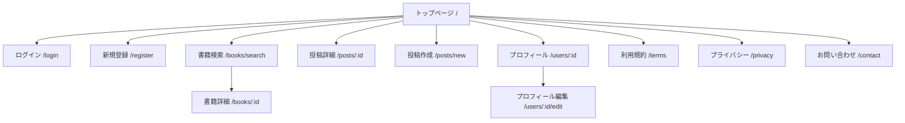

# Grim Note サイトマップ（MVP 版）

---

## 🌐 公開ページ

### `/`

- **トップページ（新着タイムライン）**

  - 投稿一覧（全ユーザーの最新投稿）
  - 投稿カード（書籍タイトル／著者／評価／本文抜粋／投稿者）
  - タブ切り替え：

    - 「新着」：全投稿
    - 「フォロー中」：フォローしたユーザーの投稿

---

### `/login`

- **ログインページ**

  - メール／パスワード入力
  - 「アカウントをお持ちでない方はこちら」→ `/register` リンク

---

### `/register`

- **新規登録ページ**

  - 名前・メール・パスワード入力フォーム
  - 成功後、自動ログインしてトップへ遷移

---

### `/books/search`

- **書籍検索ページ**

  - Google Books API による書籍検索結果一覧
  - 各書籍カードに「この本で投稿する」ボタン

---

### `/books/:id`

- **書籍詳細ページ**

  - 書誌情報（タイトル／著者／出版年／ISBN）
  - 関連投稿一覧（その本の感想投稿）

---

## 🧑‍💻 ログイン後ページ

### `/posts/new`

- **投稿作成ページ**

  - 書籍選択（検索 or 直入力）
  - 本文（最大 500 文字）
  - 評価（1〜5）
  - 読了日・タグ入力
  - 「投稿する」ボタン

---

### `/posts/:id`

- **投稿詳細ページ**

  - 本文全文・評価・読了日
  - 書籍情報
  - 投稿者プロフィールリンク
  - 「いいね」ボタン
  - 将来拡張：コメント一覧（非 MVP）

---

### `/users/:id`

- **ユーザープロフィール**

  - 名前・自己紹介・アイコン
  - 投稿一覧
  - フォローボタン
  - タブ：投稿／いいね済み（将来拡張）

---

### `/users/:id/edit`

- **プロフィール編集ページ**

  - 名前・自己紹介・アイコン更新
  - 「保存」ボタン

---

## ⚙️ その他ページ

### `/terms`

- **利用規約**

### `/privacy`

- **プライバシーポリシー**

### `/contact`

- **お問い合わせページ（通報フォーム兼用）**

  - Google Form または Slack Webhook 送信
  - 「不適切な投稿を報告」などを受け付け

---

## 🔁 ナビゲーション構造（Mermaid）

---

## 💡 備考

- **URL 設計は REST 的に整理**しており、React Router または Next.js の`app/`ルーティングで自然に構成できる。
- **SSR 対象**：トップページ・書籍詳細（SEO 強化）
- **CSR 対象**：投稿作成／プロフィール編集（ログイン必須）
- MVP 後は `/dashboard`（読書統計）や `/tags/:name`（タグ投稿一覧）を追加予定。

---
